# SwiftUICodeSnippets
这里是短视频中创建的所有代码, 希望大家喜欢, 如果发现有任何问题欢迎大家提 issues 或者 PR

# 通知
目前该仓库为公开状态, 后续会变为私有状态, 已付费的用户会收到邀请, 点击接受后可正常访问, 没有收到邀请的话可以联系我, 目前是是早鸟价大家可以在小红书/B站购买

## 目录说明
001-500 为已发布的代码

501-??? 为草稿代码, 属于制作视频时的副产物 = =

# 预览效果

### [027-StartsBackground](/SwiftUICodeSnippets/027-StartsBackgroundView)
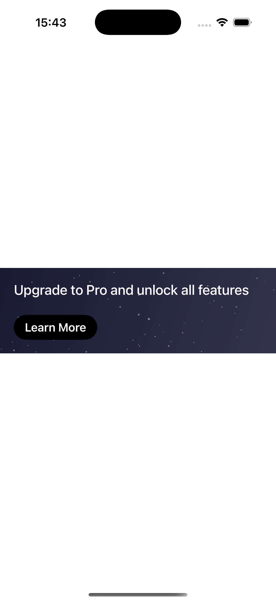

### [026-HorizontalPicker](/SwiftUICodeSnippets/026-HorizontalPicker)

### [025-BackgroundAnimation](/SwiftUICodeSnippets/025-BackgroundAnimation)

### [024-PurchaseCard](/SwiftUICodeSnippets/024-PurchaseCard)

### [023-CalendarCard](/SwiftUICodeSnippets/023-CalendarCard)
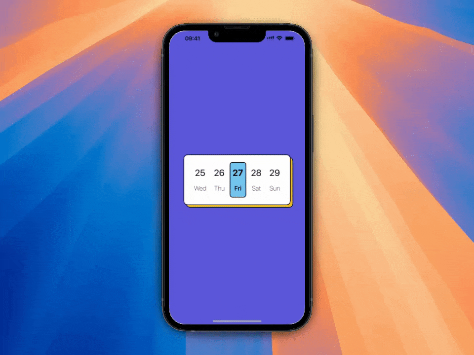

### [022-DaysPostponement](/SwiftUICodeSnippets/022-DaysPostponement)
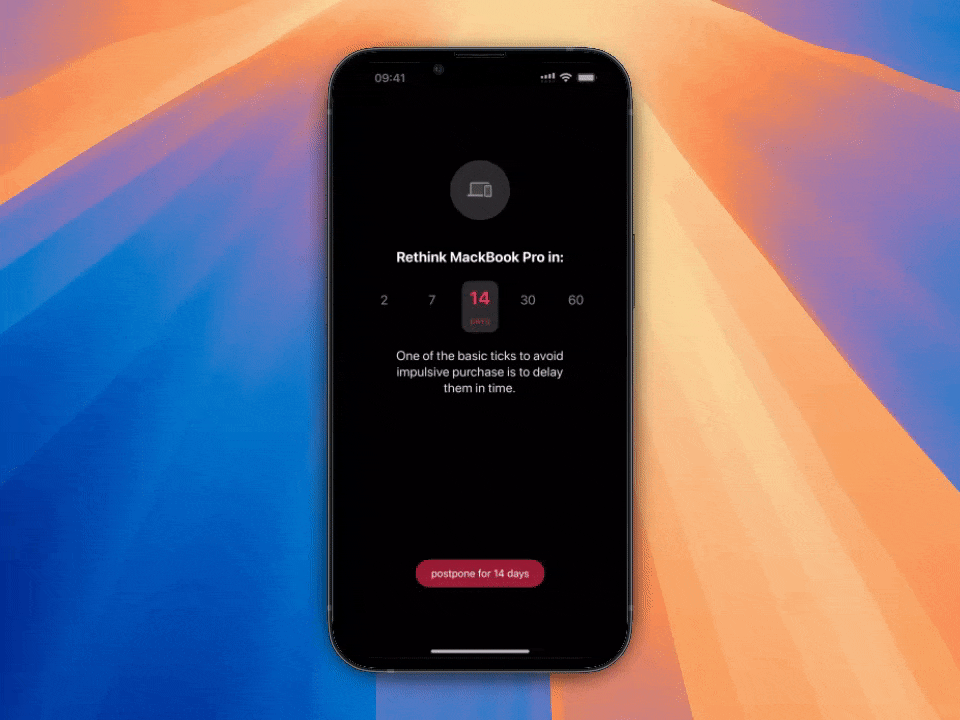

### [021-SnowShader](/SwiftUICodeSnippets/021-SnowShader)

### [020-WaveShader](/SwiftUICodeSnippets/020-WaveShader)

### [019-NumericAnimation](/SwiftUICodeSnippets/019-NumericAnimation)

### [018-SubscribePage](/SwiftUICodeSnippets/018-SubscribePage)
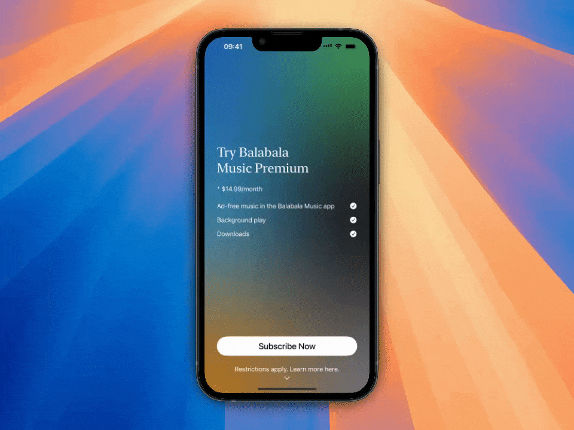

### [017-LoginPage](/SwiftUICodeSnippets/017-LoginPage)
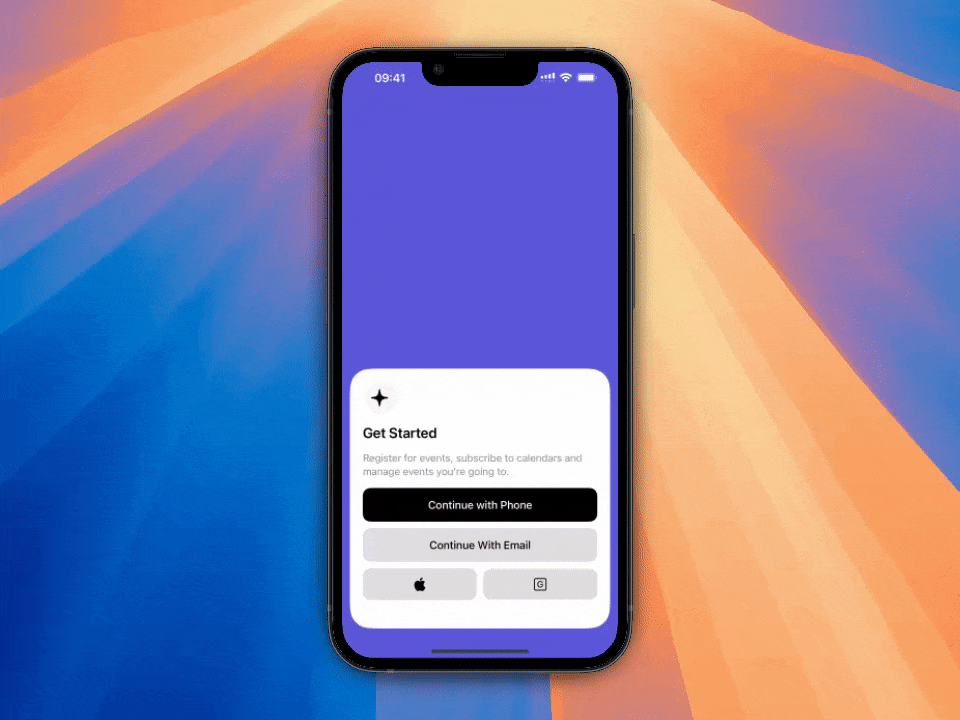

### [016-MeshGradient](/SwiftUICodeSnippets/016-MeshGradient)

### [015-ScrollTransition](/SwiftUICodeSnippets/015-ScrollTransition)

### [014-TodoCell](/SwiftUICodeSnippets/014-TodoCell)

### [013-FunnyToggle](/SwiftUICodeSnippets/013-FunnyToggle)
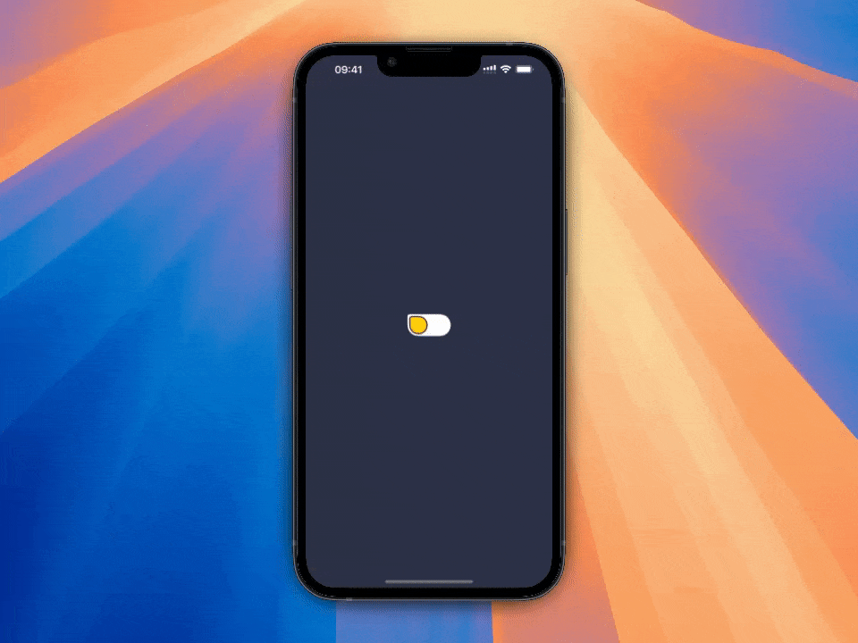

### [012-AnimatedBorder](/SwiftUICodeSnippets/012-AnimatedBorder)
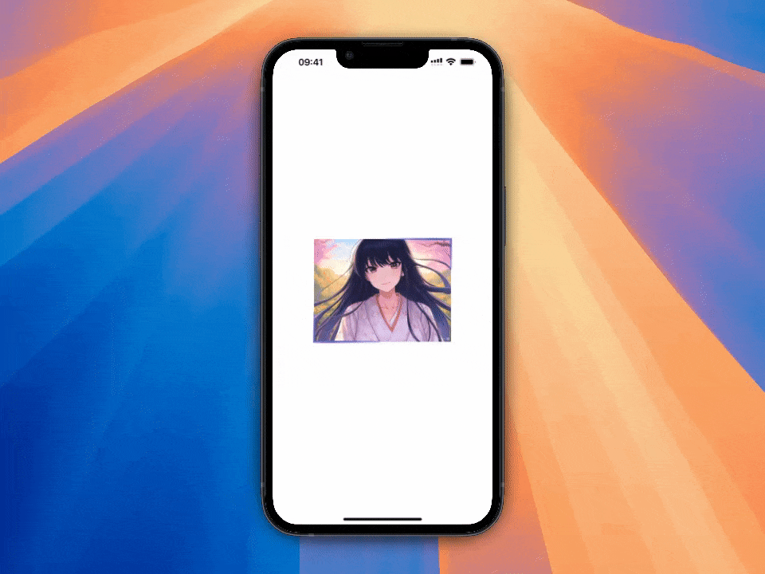

### [011-RainbowButton](/SwiftUICodeSnippets/011-RainbowButton)
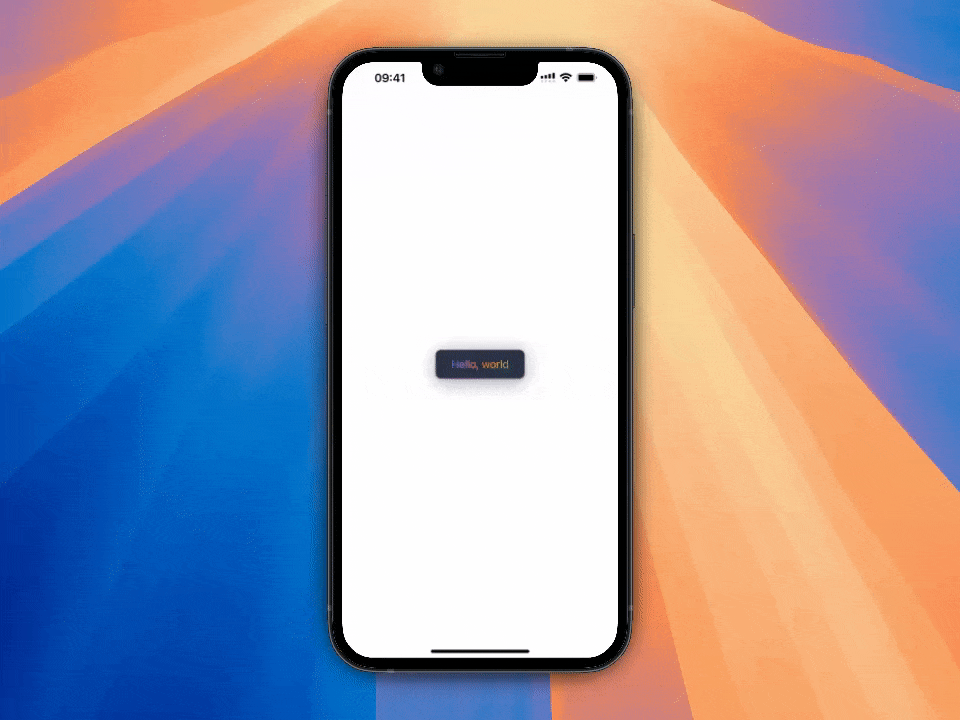

### [010-StickyHeader](/SwiftUICodeSnippets/010-StickyHeader)

### [009-ImageTransition](/SwiftUICodeSnippets/009-ImageTransition)

### [008-NavigationTransition](/SwiftUICodeSnippets/008-NavTransition)

### [007-PolishAnimation](/SwiftUICodeSnippets/007-PolishAnimation)
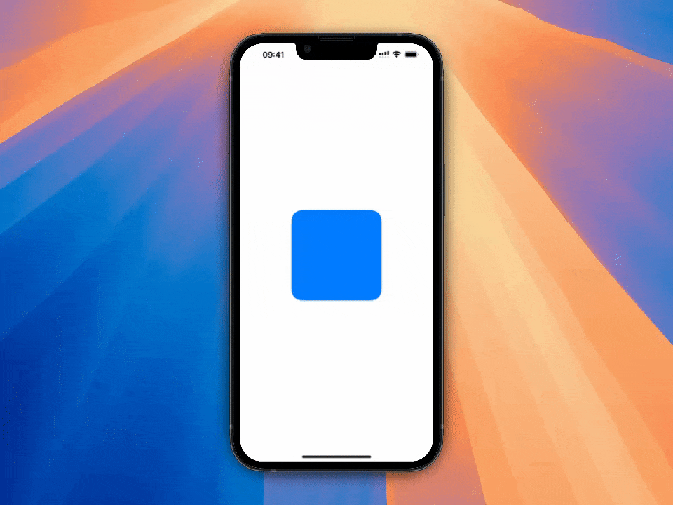

### [006-PopoverTip](/SwiftUICodeSnippets/006-PopoverTip)
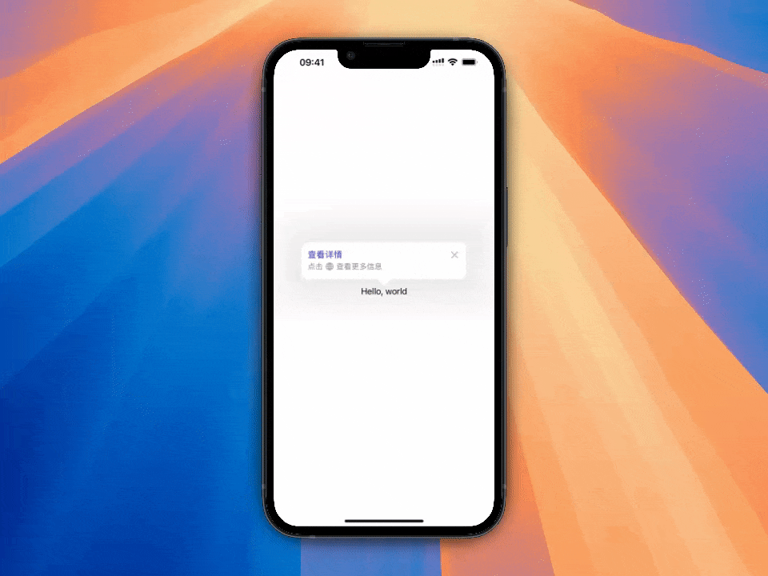

### [005-SymbolImageAnimation](/SwiftUICodeSnippets/005-SymbolImageAnimation)

### [004-SegmentedControl](/SwiftUICodeSnippets/004-SegmentedControl)
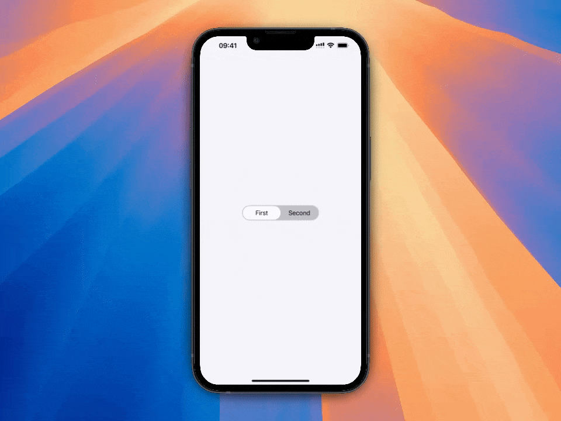

### [003-ButtonRotationAnimation](/SwiftUICodeSnippets/003-ButtonRotationAnimation)

### [002-ScaledButton](/SwiftUICodeSnippets/002-ScaledButton)
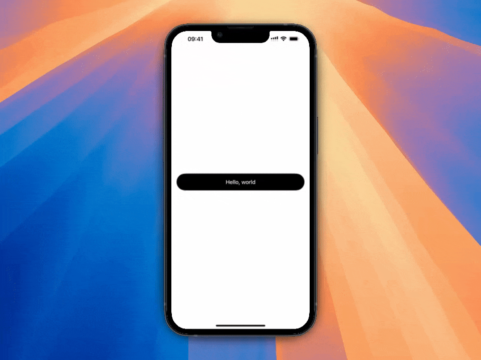

### [001-RainbowText](/SwiftUICodeSnippets/001-RainbowText)

